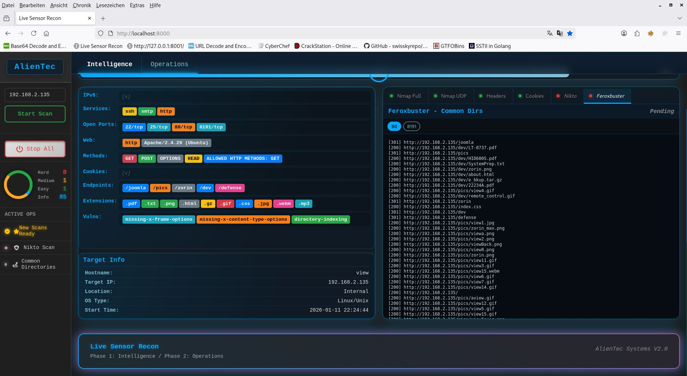
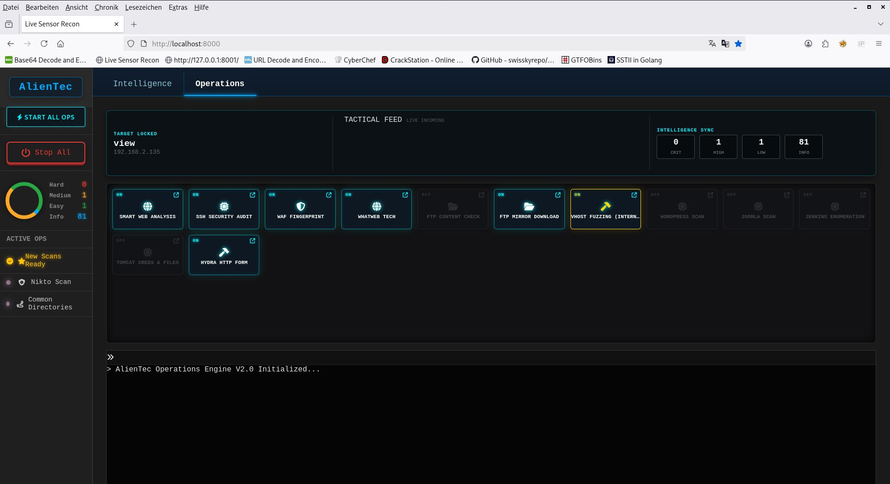

# 👽 AlienTec – Autonomous Recon Orchestration Framework

---

<p align="center">
  
</p>

**🛰️ Autonomous Recon Framework for Offensive Security**
Hands-off scanning · Live findings · Senior-grade workflows


 
---

## 🖥️ Web GUI — How to Use (Phase 1)

### 🌐 Start the Web Interface

Make sure **both services are running**:

```bash
# Django (Frontend)
python manage.py runserver 127.0.0.1:8000

# Orchestrator / Scan Engine
uvicorn engine_api:app --reload --port 8001
```

---

### 🌍 Open the GUI in Your Browser

Open your browser and navigate to:

```
http://127.0.0.1:8000
```

This loads the **AlienTec Live Recon Interface (Phase 1)**.

---
## 🖥️ GUI Walkthrough & Screenshot

📸 **Screenshot – Meltdown Web Interface**

1. Phase 1
<p align="center">
  
</p>


2. Phase 2 

<p align="center">
  
</p>

---
### 🎯 Starting a Scan

1. Locate the **Target Input Field** in the OPS Panel (left side)

2. Enter a **target IP address or domain name**

   Examples:

   ```
   192.168.1.10
   scanme.nmap.org
   ```

3. Click **Start Scan**

---

### ⚙️ What Happens After Clicking “Start Scan”

* The GUI sends the target to the **Phase‑1 Orchestrator**
* The orchestrator launches:

  * Nmap Full Port Scan
  * UDP / IPv6 scans (if enabled)
* Live Findings, HUD Panel, OPS Panel and Progress Bar update **in real time**
* Discovered services appear immediately in the **Live‑Finding System**
* Severity counters and task states update dynamically

No manual interaction is required after pressing **Start Scan**.

---

### 🛑 Stop Scan (Emergency)

* Press **Stop Scan** in the OPS Panel
* The orchestrator terminates all running tasks cleanly

---

## 📍 Where to Place This Section in the README

👉 **Insert this section directly AFTER:**

```
## 🚀 Running the Framework (Phase 1)
```

and **BEFORE:**

```
## ▶️ How Phase 1 Works (Operational Flow)
```

So the flow for the reader is:

1. Install
2. Start services
3. **Use the GUI**
4. Understand orchestration

---

# ⚙️ Installation & Operation — Phase 1

## 📌 Scope of This Repository
````markdown
## 🛠️ Installation & Setup

### 1. Automatic Installation

This repository includes an `install.sh` script to automate the setup process. It performs the following tasks:

- **System Checks**: Verifies root privileges and required system dependencies  
- **Python Setup**: Creates a virtual environment (`venv`) and installs requirements  
- **Database**: Initializes the Django database and static files  
- **SecLists**: Checks for `/usr/share/seclists`  
  - If missing, installs via `apt` or clones from GitHub automatically

Run the following commands to set up the engine:


# 1. Make the script executable

```
chmod +x install.sh
```

# 2. Run the installer (root privileges required for SecLists & system deps)

```
sudo ./install.sh
```

**Note:**
The script checks for external scanning tools (e.g. `nmap`, `feroxbuster`, `nikto`).
If missing, it will warn you and you must install them manually, for example:

```
sudo apt install nmap feroxbuster nikto
```

---

### 2. Configuring Wordlists (Manual)

In the current version, wordlist paths are hardcoded in the source code.
By default, the engine expects SecLists at:

```
/usr/share/seclists/
```

If you want to use custom wordlists or store them in a different directory, you must modify the Python configuration directly.

#### Step-by-Step Guide

1. Open the following file:

```
nano recon_engine/scans.py
```

2. Locate the `SCANS_TO_RUN` variable.
   This list defines the commands executed by each tool.

3. Find the **Feroxbuster** entries and look for the `-w` (wordlist) flag.

---

#### Example

**Before (default SecLists path):**

```python
{
    "id": "ferox_common",
    "name": "Feroxbuster - Common Directories",
    "command": [
        "feroxbuster",
        "-u", "{URL}",
        # CHANGE THIS LINE:
        "-w", "/usr/share/seclists/Discovery/Web-Content/directory-list-2.3-big.txt",
        "-k", "--json", "--silent",
        "--output", "logs/{TARGET}/ferox_common.json"
    ]
},
````

**After (custom wordlist path):**

```python
{
    "id": "ferox_common",
    "name": "Feroxbuster - Custom List",
    "command": [
        "feroxbuster",
        "-u", "{URL}",
        # YOUR NEW PATH:
        "-w", "/home/user/my_wordlists/custom_dic.txt",
        "-k", "--json", "--silent",
        "--output", "logs/{TARGET}/ferox_common.json"
    ]
},
```
 
This repository currently contains **Phase 1 (Live Recon Showcase)** of the **AlienTec Django Recon Framework**.

* ✅ Phase 1: **Active Recon + Live Visualization**
* 🚧 Phase 2: **Subroutines (≈45 modules)** — *in development*
* 🚧 Phase 3: **Reporting & Correlation Engine** — *planned*

Phase 1 is intentionally released as a **reduced, showcase version** to demonstrate architecture, orchestration, and live systems.

---

## 🧩 Requirements

* 🐧 **Linux** (recommended: Kali Linux)
* 🐍 **Python 3.11+**
* 📦 `pip`
* 🌐 Network access (for scanning targets)

---

## 📦 Installation

```bash
git clone https://github.com/AlienTec1908/recon_with_django.git
cd recon_with_django
```

(Optional but recommended)

```bash
python3 -m venv venv
source venv/bin/activate
```

Install dependencies:

```bash
pip install -r requirements.txt
```

---

## 🗂️ Relevant Project Structure

```text
recon_with_django/
├── manage.py                     # Django entry point
├── engine_api.py                 # Orchestrator & API layer (FastAPI)
├── requirements.txt
├── recon_engine/                 # Core orchestration logic
├── recon_livesensor_project/     # Live sensor & UI bridge
├── scanner/                      # Phase 1 scan modules
├── back.index.html               # Frontend entry point
└── readme.md
```

---

## 🧠 Architecture Overview (Phase 1)

Phase 1 follows a **strict modular orchestration model**:

* Every system is an **isolated module**
* No module directly controls another module
* **All coordination happens via the Phase‑1 Orchestrator**
* Communication is handled through **JSON state & output files**

Core principle:

> **Modules do not know each other — the Orchestrator knows all.**

---

## 🚀 Running the Framework (Phase 1)

### 1️⃣ Django Core (UI / Structure)

```bash
python manage.py migrate
python manage.py runserver 127.0.0.1:8000
```

Django is used for:

* UI integration
* State representation
* Project structure

---

### 2️⃣ Orchestrator & Scan Engine (Mandatory)

The actual scan logic is executed via **FastAPI + Uvicorn**:

```bash
uvicorn engine_api:app --reload --port 8001
```

This starts:

* 🧠 Phase‑1 Orchestrator
* 📡 Live parser pipeline
* ⚙️ Scan dispatch engine
* 📊 State & progress tracking

---

## 🌐 Access Points

* **Orchestrator / API**

  ```
  http://127.0.0.1:8001
  ```

* **Frontend (UI)**

  ```
  http://127.0.0.1:8000
  ```

---

## ▶️ How Phase 1 Works (Operational Flow)

1. User enters a target IP in the UI
2. User clicks **Start Scan**
3. The **Phase‑1 Orchestrator** takes full control

The orchestrator then:

* 🔍 launches `nmap_fullport`
* 📡 parses findings into live JSON state
* 🧠 evaluates discovered services
* 🗂️ feeds Live‑Finding & HUD systems
* 📊 updates progress & severity engines

⚠️ **Scans are never started directly by the UI.**
All execution logic lives inside the orchestrator.

---

## 🧠 Orchestration Rules (Phase 1)

* `nmap_fullport` is the **primary data source**
* HTTP‑based scans wait for Nmap service discovery
* UDP & IPv6 scans may run asynchronously
* Live‑Finding, HUD, OPS Panel poll shared JSON state
* Progress & severity are calculated continuously

---
Ah, mein Fehler. Natürlich, das macht absolut Sinn.

Hier sind dieselben Abschnitte, die ich erstellt habe, jetzt komplett auf Englisch und als reiner Markdown-Block zum Kopieren.

---

## ✨ Features

*   **Autonomous Scanning:** Launch a full recon pipeline with a single click.
*   **Live Finding System:** Results appear in the web interface in real-time—no more waiting for scans to finish.
*   **Modular Architecture:** Every scan module is isolated and controlled by the central orchestrator.
*   **Real-time Dashboard:** Visually track findings, progress, and severity via a heads-up display (HUD).
*   **Scalable Design:** Built for easy integration of dozens of additional modules (Phase 2 & 3).

---

## 🛠️ Tech Stack

*   **Backend & Orchestrator:** Python, FastAPI
*   **Frontend:** Django, HTML, CSS, JavaScript
*   **Scan Tools (Phase 1):** Nmap
*   **Asynchronous Tasks:** Uvicorn, Asyncio

---

## 🗺️ Roadmap

-   [✔️] **Phase 1: Live Recon Showcase** - Stable foundation with Nmap integration and live visualization.
-   [🚧] **Phase 2: Subroutines & Advanced Scans** - Integration of ~45 modules for subdomain enumeration, directory bruteforcing, vulnerability scanning, etc.
-   [🗓️] **Phase 3: Reporting & Correlation Engine** - Automated report generation, finding correlation, and attack timeline creation.

---

## 🤝 Contributing

Contributions are welcome! If you have ideas, find bugs, or want to add new features, please open an "Issue" first to discuss it. Pull Requests are also welcome.

---

## 📄 License

This project is licensed under the MIT License. See the `LICENSE` file for details.
## ⚙️ Design Principles

* 🧩 **Modular** — each system is standalone
* 🔁 **Replaceable** — modules can be swapped without refactoring others
* 📄 **State‑driven** — JSON is the single source of truth
* 🧪 **Testable** — every module can run independently
* 🚀 **Scalable** — Phase 2 & 3 plug into the same model

---

## ⚠️ Disclaimer

This project is provided **for educational and authorized security testing only**.

* Unauthorized scanning is illegal
* The author assumes **no responsibility for misuse**
* Always obtain **explicit permission** before scanning any target

---

 
