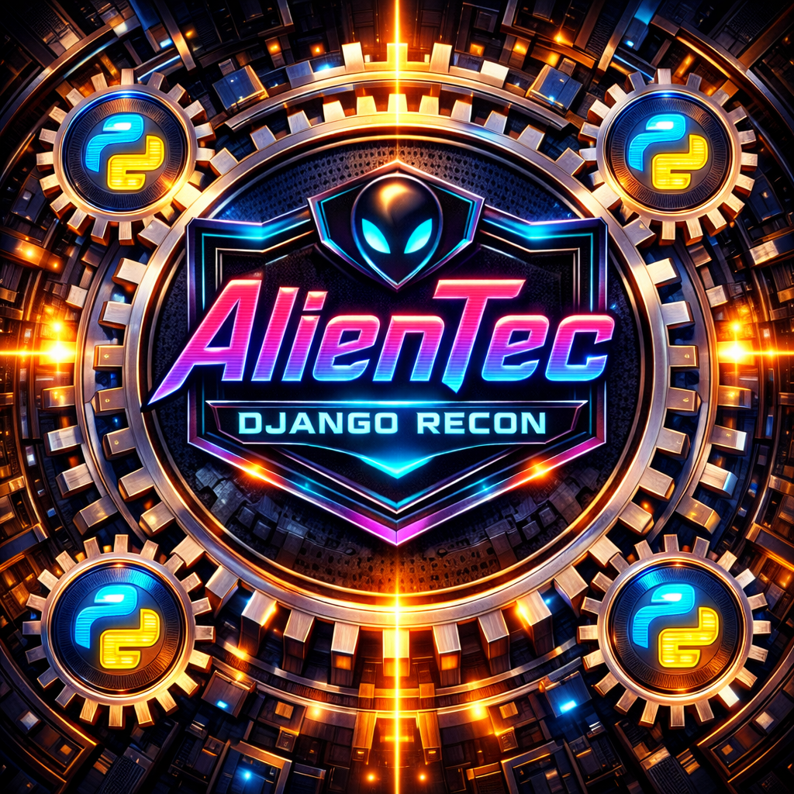

# 👽 AlienTec – Autonomous Recon Orchestration Framework

---

  

**🛰️ Autonomous Recon Framework for Offensive Security**
Hands-off scanning · Live findings · Senior-grade workflows

---

## 🧬 Overview

**AlienTec Django Recon** is a **modular, event-driven reconnaissance framework** built for
🧑‍💻 **professional offensive security** and **real-world recon operations**.

Core philosophy:

* 🧠 Logic-driven orchestration
* 🔁 Live signal feedback
* ⚙️ Rule-based scan execution
* 🚫 No blind or useless scans

This repository exposes **Phase 1 only** as a **controlled showcase release**.

---

## 🧱 Project Scope

This repository includes:

* ⚙️ **Phase 1 – Core Recon Orchestration** *(implemented)*
* 🧪 **Phase 2 – Deep Enumeration Subroutines (45+ modules)** *(in development)*
* 📊 **Phase 3 – Reporting, Correlation & Intelligence Layer** *(planned)*

Only **Phase 1** is active in this public version.

---

## ⚙️ Phase 1 – Architecture Overview

Phase 1 introduces a **central Orchestrator** acting as a
🧠 **rule engine**, 🛰️ **signal router**, and ⚙️ **execution controller**.

The Orchestrator:

* 📂 Loads system logic definitions
* 🧩 Builds execution chains dynamically
* 🧪 Validates scan prerequisites
* 📡 Reacts to live findings
* 🔒 Blocks invalid execution paths

No scan runs without context.

---

## 🧩 Core Systems (Phase 1)

### 🧭 1. Start Scan System (Entry Point)

* 🎯 Accepts target input (IP / range)
* 🚀 Triggers orchestration
* 🧠 Hands control to the Orchestrator immediately
* 🚫 Executes **no scans directly**

Purpose:
A clean, logic-free entry layer.

---

### 🧠 2. Orchestrator (Central Control Layer)

The Orchestrator is the **core intelligence layer**.

Responsibilities:

* 🧾 Parse all system logic files
* 🧮 Build ordered execution lists
* 🧠 Enforce rule conditions
* 📊 Track scan state
* 🔁 Dispatch scans
* 📡 Receive live parser signals

It decides **what runs, when, and why**.

---

### 📡 3. Live Parser System

* 🔍 Parses scan output in real time
* 🧬 Extracts high-value signals
* 🧾 Normalizes findings into JSON
* 📡 Signals the Orchestrator

Examples:

* 🌐 HTTP / HTTPS detected
* 🛠️ Service identified
* ✅ Scan completed
* 🚫 Scan useless → blocked

---

### 🗂️ 4. Tab System (Contextual Dispatcher)

The Tab System is **execution-only**, not decision-making.

It:

* 🧠 Receives commands from the Orchestrator
* 🧵 Spawns scans in isolated tabs
* 🌐 Binds scans to valid services
* 🧼 Keeps logic clean and separated

Tabs appear **only when justified**.

---

### 🖥️ 5. UI Layer (Phase 1 Scope)

The UI is **read-only intelligence**, not control logic.

Displays:

* ⚙️ Active scans
* 📄 Finished scans
* 📡 Live findings
* 🧵 Context-based tabs
* 🧠 Execution order visibility

---

## 🔁 Execution Flow (Simplified)

1. ▶️ User presses **Start**
2. 🧠 Orchestrator parses system logic
3. ⚙️ Initial recon validated & launched
4. 📡 Live parser extracts signals
5. 🧠 Orchestrator evaluates conditions
6. 🌐 Contextual scans unlocked
7. 🗂️ Tabs spawn valid scans
8. 📊 Results update continuously

---

## 🧠 Design Rationale

This architecture avoids:

* 🚫 Blind scan chains
* 🚫 Hardcoded pipelines
* 🚫 Tool spamming
* 🚫 Context-less execution

It enables:

* 🧠 Senior-grade recon logic
* 🛰️ Environment awareness
* 📉 High signal-to-noise ratio
* 🧩 Clean Phase 2 & 3 expansion

---

## ⚠️ Disclaimer

This framework is intended for:

* 🎓 Education
* 🧪 Research
* 🛡️ Authorized security testing only

You **must** have explicit permission to scan any target.

The author assumes **no responsibility** for misuse or legal violations.

---

## 📜 License

MIT License
See `LICENSE` for details.

---

 
