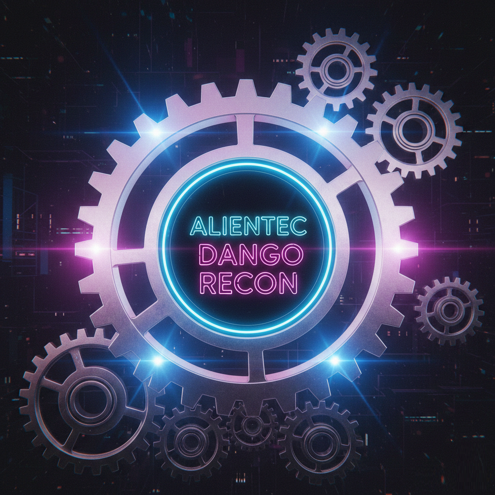

<p align="center">
  
</p>

<p align="center">
  <b>Autonomous Recon Framework for Offensive Security</b><br>
  Hands-off scanning · Live findings · Senior-grade workflows
</p>

<p align="center">
  
  
  
  
</p>

---

## ⚡ SYSTEM BLUEPRINT: Command Center V2.0

### 🛠 Project Status
- **Phase 1 (Discovery):** **INTEGRATED** - Core engine & initial recon.
- **Phase 2 (Operations):** **UNDER DEVELOPMENT** - 45+ Subroutine modules & Intelligent Chessboard UI.
- **Phase 3 (Reporting):** **PLANNED** - High-grade analytics & automated reporting.

### 🏛️ Core Architecture
- **Django (The Launcher):** UI Shell & User Management.
- **FastAPI (The Engine):** Stateless Scan Engine streaming via WebSockets.

### 🛠️ Installation
```powershell
git clone [https://github.com/AlienTec1908/recon_with_django.git](https://github.com/AlienTec1908/recon_with_django.git)
cd recon_with_django
pip install -r requirements.txt
python manage.py migrate
